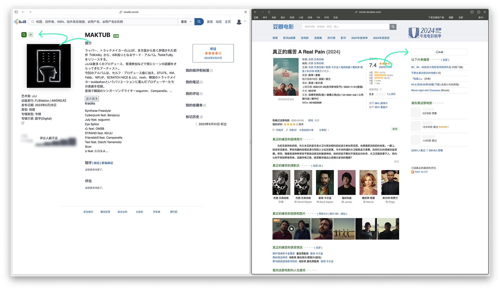

&nbsp;

<p align="center">
  
  <h1 align="center">Neo2DB</h1>
</p>

  <p align="center">
    Auto-fill Douban Music submissions from NeoDB<br>
    Quickly search between Douban and NeoDB with direct page navigation
  </p>

## Installation

1. Clone and extract this project
2. Set up your NeoDB Access Token:
   - Open `entrypoints/content.tsx`
   - Find the `AccessToken` variable
   - Replace `YOUR_NEODB_ACCESS_TOKEN` with your token from https://neodb.social/developer/
   - Note: Just replace the token part, keep the "Bearer " prefix
3. Install dependencies and build the extension:
   ```bash
   pnpm install
   pnpm build
   ```
4. Open `chrome://extensions/` in your browser and enable Developer Mode
5. Click "Load unpacked" and select the `.output/chrome-mv3` directory from the project

## Usage

1. On a NeoDB album page, click the ➕ button next to the cover:
   - Automatically transfers album information to the Douban Music submission form
   - Automatically downloads the album cover image to your computer
   - Automatically opens the Douban Music submission page and fills in the information

2. On NeoDB album/movie/TV/book pages, click the 🔍 button next to the cover:
   - Search for the corresponding entry on Douban

3. On Douban music/movie/book pages, click the NeoDB logo button at the top of the right sidebar:
   - Search for the corresponding entry on NeoDB

  

## License

MIT
